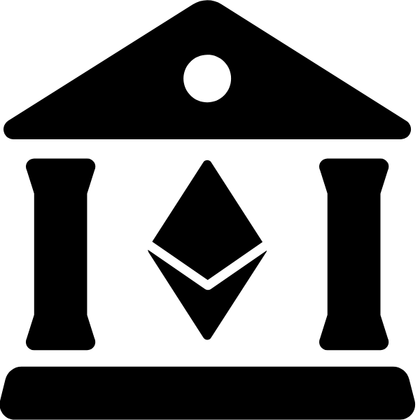

#  Smart Bank

*A smart-contract based wallet for everyone!*

This project is part of the [Blokckternship](https://github.com/Blockternship/take-off) distributed social hackathon. The initial motivation is outlined [here](https://github.com/Blockternship/projects/issues/7). In summary - this is a smart contract-based wallet with some advantages over traditional multisig wallets.

## Philosophy

We want to bring smart-contract based wallets to the average user - they should understand that public/private key- or passphrase-based wallets are intrinsically not secure (either from theft or loss). You don't lose all of your savings just because you've lost your ATM card together with your wallet, and we think this should hold true in the crypto world. The Smart Bank should be analogous to a traditional bank, but without the need for a third party:
 
* You can keep the majority of your assets locked up behind additional layers of security
* Large transactions should require additional confirmations (like a traditional multisig)
* You can withdraw, through trusted accounts up to some daily limit, without needing extra security
* When an account is compromised you should be able to blacklist it (just as you can deactivate a stolen credit card)
* If something would happen to you, your family or friends should be able to recover your funds
* The smart bank should fulfil the promise of crypto: *Be your own bank!*

In order to increase security, but still keep it trustless, the user(s) will be able to add additional *owner* accounts (ethereum address). A smart bank should be useable by persons or organizations, since the owner accounts could be different addresses owned by the same person (e.g. Metamask, Mobile wallet, Hardware wallet), or they could be owned by different people.

There should also be a list of *recovery* accounts, which should ideally **not** be owned by the smart bank account owner (when used as a personal bank account). These recovery accounts should be able to recover **all funds** after some period of inactivity (say 1 year).

Users will be advised to add at least two owner and two recovery accounts.

## Implementation/ Viability

Most of the functionality described above already exists in traditional multisig wallets. Specifically, we're looking at the Gnosis [Safe Contracts](https://github.com/gnosis/safe-contracts) - they implement lots of functionality in a modular and secure way. Ideally we should be using proxy contracts, as the original Gnosis contracts do, but for the sake of simplicity we will implement the "smart bank" as a standalone contract. 

We, of course would like to add something more on top of  existing multisig wallet implementations. The first priority should be usability for non-technical users. Here's a list of features we would like to implement differently from a normal multisig:

1. **Expiring bank account** - as mentioned, being able to assign recovery accounts which would inherit the main account after a period of inactivity.
2. **Recovery accounts** - accounts which can only be used for recovery help or inheritance.
3. **Sub-accounts** - being able to internally divide assets into separate "accounts" with different rules. For instance, keep your savings untouchable with a delayed lock, while leaving some spending money in a different sub-account with a daily allowance.
    * Sub accounts should also have the option of "external spenders" - non-owner accounts which can spend the daily limits (e.g. you can make an account for a family member/ friend)
    * Withdrawal limits should either be daily or monthly
4. **USD equivalent limits** - users should be able to set a single daily limit per sub-account in USD. Withdrawing any ETH or ERC20 tokens should be reflected on the allowance depending on the price of the given asset at the time of withdrawal. There will probably be a list of supported tokens, and all others will need to have a specific allowance set.
5. **An intuitive UI** - ideally something like the new Ledger app, which can show your assets as a portfolio. It should also be possible to see all transactions, sub-accounts, limits, etc. There should be an easy interface for withdrawing within the daily limit, and another interface for "advanced" transactions outside the limits (multisig transactions). Any settings changes will also require multisig transactions.
6. *Delayed changes* - ideally, any multisig change of settings or approval of a transaction should have some delay implemented, such that it can be revoked. Even if all required accounts approve a transaction, it should be possible to reject it before it can be executed. If someone steals two of your wallets somehow and is able to do multisig transactions, you should still be able to reject them until you get a hold of your recovery partners. *(nice to have)*
7. *Automatic split of deposits among sub-accounts* - you should be able to deposit and automatically split funds - e.g. 10% goes to your retirement account, 30% goes to your Lambo savings, 60% goes to your expenses account. *(nice to have)*
8. *Automatic loans from locked accounts* - This is a feature which would be *nice to have* in the future - being able to lock up your long-term assets as collateral for MakerDAO CDPs and getting a loan in Dai. *(nice to have)*
9. *Address book* - Being able to resolve ENS addresses and assign custom names to any address *(nice to have)*

---

## Legal Stuff

All contracts are WITHOUT ANY WARRANTY; without even the implied warranty of MERCHANTABILITY or FITNESS FOR A PARTICULAR PURPOSE.

## License

All code is released under LGPL v.3.

## Contributors

* Paskal S [@paradoxDAO](https://github.com/paradoxDAO)
* Deam [@deamme](https://github.com/deamme)